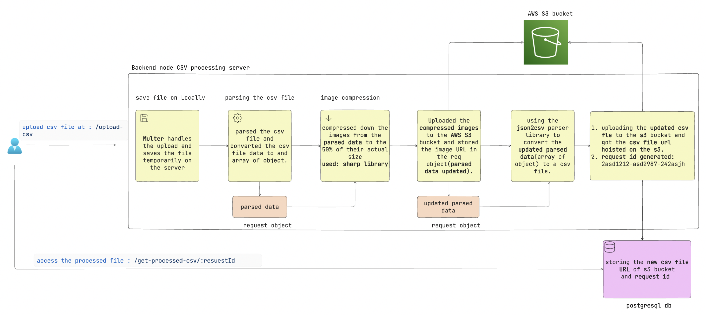

## Application Overview

This project focuses on the full flow of processing CSV files and image handling, from file upload, image compression, and storage in AWS S3, to returning processed results. The application consists of the following key features:

1. **Frontend**: User interface to upload CSVs and check the status of processed files.
2. **Backend**: File upload handling, image processing, database interaction, and S3 integration.
3. **Database**: A PostgreSQL database to store metadata and track `requestId`.
4. **AWS S3**: Used for storing both original and processed images, as well as the processed CSV files.

---

## Technologies Used

1. **Frontend** (React with Bootstrap)
2. **Backend** (Node.js, Express.js)
3. **Database** (PostgreSQL via Knex.js)
4. **AWS S3** (Amazon Web Services)

## Application Workflow

### 1. **CSV File Upload**
- The user first uploads a CSV file via the **FileUploadForm** in the frontend.
- This form makes a `POST` request to the `/upload-csv` endpoint on the backend, using Axios. The file is sent in `multipart/form-data` format.
- The file is received by the backend, where Multer handles the upload and saves the file temporarily on the server.

### 2. **CSV Parsing & Image Processing**
- After the file is uploaded, the backend parses the CSV. It extracts the image URLs from the CSV file.
- For each image URL, the backend fetches the image, compresses it by 50% using the `sharp` library, and uploads the compressed image to AWS S3. This offloads the file storage and ensures that the compressed images are accessible via S3 URLs.
- A new CSV file is generated with the updated image URLs pointing to the compressed images on S3.

### 3. **Storing Metadata and Returning Request ID**
- Once the processing is complete, the metadata (such as the `requestId` and the updated CSV file URL) is stored in the PostgreSQL database.
- A unique `requestId` is generated and sent back to the user in the response. The `requestId` can be used later to check the status or download the processed file.

### 4. **Checking Status of Processed CSV**
- Users can enter their `requestId` in the **RequestIdForm** in the frontend.
- This form sends a `GET` request to `/get-processed-csv/:requestId` on the backend.
- The backend queries the database using Knex.js to check if the `requestId` exists. If found, the backend returns the URL of the processed CSV file stored in S3.
- The frontend then displays a button or link for the user to download the processed CSV file.

---
